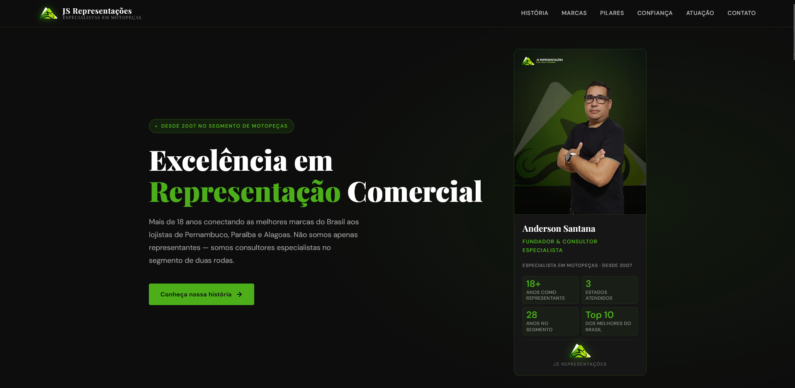

# JS Representações — Site Institucional



> Site institucional da **JS Representações**, empresa especializada em representação comercial de motopeças no Nordeste do Brasil, com mais de 18 anos de atuação em Pernambuco, Paraíba e Alagoas.

🚀 **Deploy:** [jsrepresentacoes-site.vercel.app](https://jsrepresentacoes-site.vercel.app)

---

## Sobre o Projeto

Site institucional desenvolvido para apresentar a história, o portfólio de marcas e os diferenciais da JS Representações, empresa fundada em 2007 por Anderson Santana. O objetivo é gerar credibilidade junto a lojistas do segmento de motopeças e facilitar o contato comercial.

---

## Funcionalidades

- Apresentação institucional com história do fundador
- Vitrine das marcas representadas (Rinaldi, Delta, Control Seals, EBF, Stallion, Coyote, Circuit, Renascença, Zouil, FAR Rafaela)
- Seção de pilares e diferenciais da empresa
- Área de cobertura geográfica (PE, PB e AL)
- Links diretos para contato via WhatsApp, e-mail e Instagram
- Design responsivo para mobile e desktop

---

## Stack

| Tecnologia | Uso |
|---|---|
| **Next.js** | Framework principal (React) |
| **Vercel** | Hospedagem e deploy contínuo |
| **TypeScript** | Tipagem estática |
| **Tailwind CSS** | Estilização |

---

## Estrutura de Seções

```
/
├── Hero          → Apresentação principal com estatísticas
├── #about        → História de Anderson Santana
├── #marcas       → Portfólio de marcas representadas
├── #pillars      → Os 3 pilares: Expertise, Parceria, Presença
├── #trust        → Razões para escolher a JS Representações
├── #coverage     → Área de atuação (mapa PE · PB · AL)
└── #contact      → Links de contato
```

---

## Rodando Localmente

```bash
# Clone o repositório
git clone https://github.com/kibedev/jsrepresentacoes.git
cd jsrepresentacoes

# Instale as dependências
npm install

# Inicie o servidor de desenvolvimento
npm run dev
```

Acesse [http://localhost:3000](http://localhost:3000).

---

## Deploy

O projeto está configurado para deploy automático na **Vercel**. Qualquer push na branch `main` aciona um novo deploy.

```bash
# Build de produção
npm run build

# Iniciar em modo produção
npm start
```

---

## Contato

- 📱 WhatsApp: [+55 81 99354-6117](https://wa.me/5581993546117)
- 📧 E-mail: andersonjsrepresentacoes@gmail.com
- 📸 Instagram: [@js.representacaoo](https://www.instagram.com/js.representacaoo/)

---

© 2025 JS Representações. Todos os direitos reservados.
